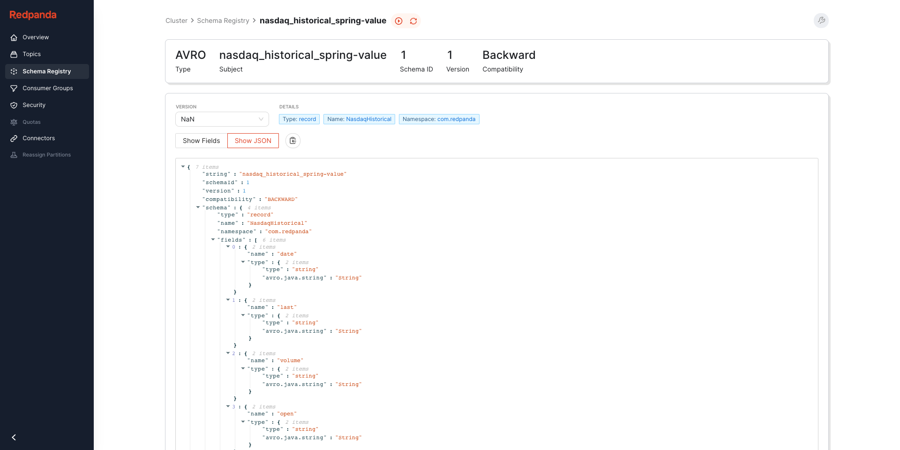

# Redpanda + Spring Boot

Using Redpanda with Spring Boot and Apache Avro.

# Run

```shell
docker-compose up -d
mvn spring-boot:run
```

# View

Browse to Console at: http://localhost:8080




# Shutdown

```shell
docker-compose down -v
```
